## 📖 프로젝트 소개

> 혼자 공부하는 시대는 끝났다❌  
> 코딩을 배우는 수강생, 가르치는 강사, 함께 성장하고 싶은 모두가 모이는  
> `OZ Coding School`은 쪽지시험, Q&A, 커뮤니티를 통해  
> 학습자들이 서로의 지식을 나누고 함께 성장합니다.  
> 더 스마트한 학습 경험, `OZ Coding School`에 오신 걸 환영합니다!

---

## 🔗 배포 링크

> ### [🏫 OZ Coding School 바로가기](https://my.ozcodingschool.site/)

---

## 🗣️ 프로젝트 발표 영상 & 발표 문서

> ### 🗓️ 2026.05.18
>
> ### [📑 발표 문서]()

---

## 🖥️ 서비스 소개

|                 랜딩페이지                  |                 소셜 로그인                  |                    일반 회원가입                    |
| :-----------------------------------------: | :------------------------------------------: | :-------------------------------------------------: |
| 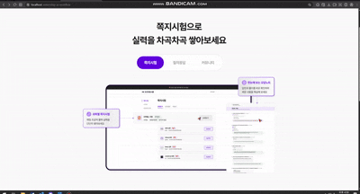 | 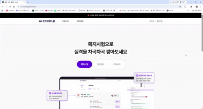 |  |

|                            아이디·비밀번호 찾기                            |                   수강생 등록                   |                  탈퇴회원 복구                   |
| :------------------------------------------------------------------------: | :---------------------------------------------: | :----------------------------------------------: |
|  | 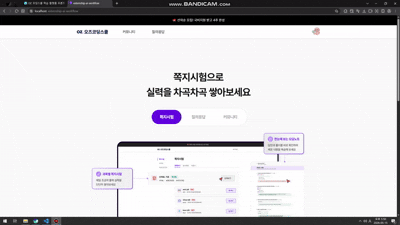 | 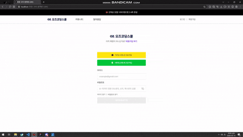 |

|                 마이페이지                  |                     수정하기                      |                회원탈퇴                 |
| :-----------------------------------------: | :-----------------------------------------------: | :-------------------------------------: |
| 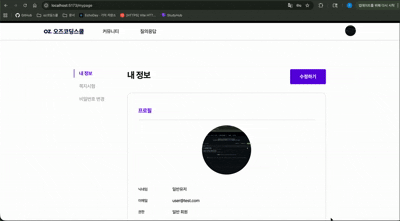 | 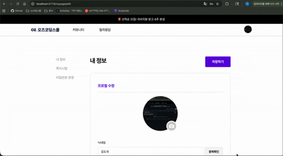 | 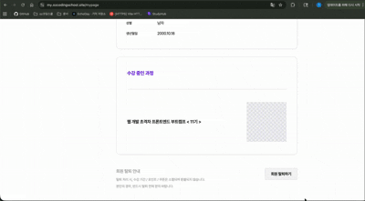 |

|                    휴대전화번호 변경                     |                  비밀번호 변경                   |                  쪽지시험 응시                   |
| :------------------------------------------------------: | :----------------------------------------------: | :----------------------------------------------: |
| 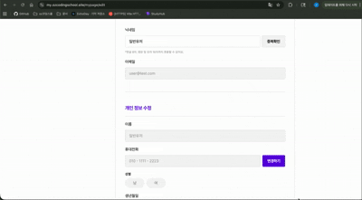 | 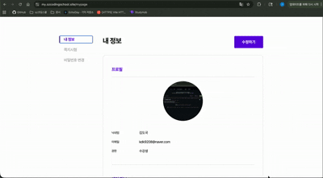 | 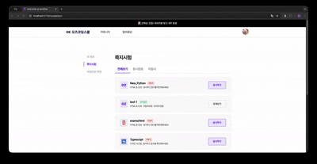 |

|                부정행위 감지                 |                시간 초과                 |                 관리자 종료                  |
| :------------------------------------------: | :--------------------------------------: | :------------------------------------------: |
| 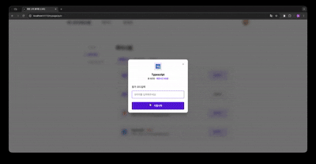 | 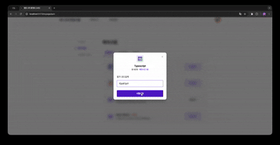 | 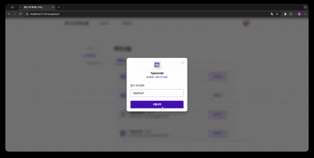 |

---

## 🧰 사용 스택

### FE

<div align="center">
  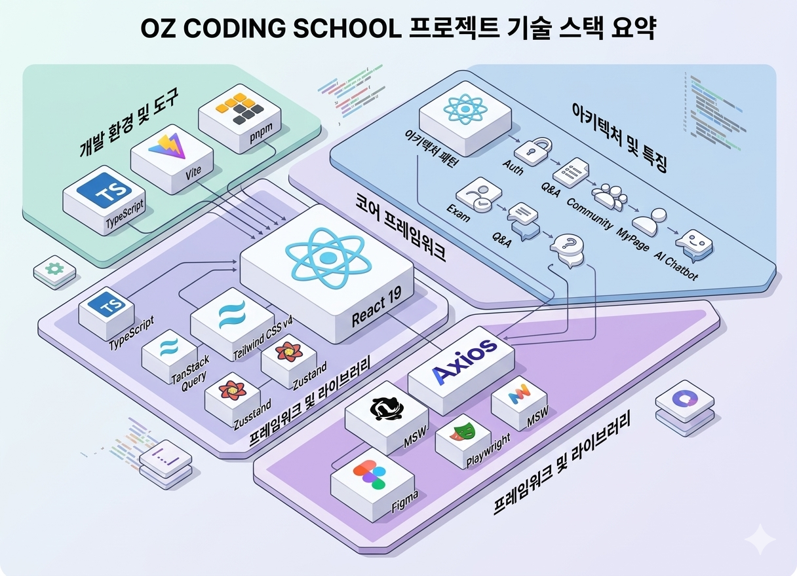
</div>
---

## 👥 팀 동료

### FE

| <a href="https://github.com/GAMMJ"><br/><sub><b>@GAMMJ</b></sub></a> | <a href="https://github.com/leegyuhan99"><br/><sub><b>@leegyuhan99</b></sub></a> | <a href="https://github.com/kmin0111"><br/><sub><b>@kmin0111</b></sub></a> | <a href="https://github.com/dogui1018"><br/><sub><b>@dogui1018</b></sub></a> |
| :-----------------------------------------------------------------------------------------------------------------------: | :-----------------------------------------------------------------------------------------------------------------------------------------: | :--------------------------------------------------------------------------------------------------------------------------------: | :-----------------------------------------------------------------------------------------------------------------------------------: |
|                                                          김민재                                                           |                                                                   이규한                                                                    |                                                               변경민                                                               |                                                                김도국                                                                 |
|            쪽지시험 목록·응시·결과 페이지<br/>시험 상태 폴링<br/>참가코드 모달<br/>공통 인프라(Toast·Error UI)            |                                  로그인·회원가입·소셜로그인<br/>JWT 인증 인터셉터<br/>이메일·비밀번호 찾기                                  |                                탈퇴회원 복구 모달<br/>수강신청 페이지 라우트<br/>GNB 외부 링크 처리                                |                                마이페이지<br/>비밀번호 변경<br/>회원탈퇴 모달<br/>프로필 이미지 업로드                                |

---

## 🚀 로컬 실행 방법

```bash
# 패키지 설치
pnpm install

# 개발 서버 실행 (http://localhost:5173)
pnpm dev

# 빌드
pnpm build

# E2E 테스트
pnpm test:e2e
```

> MSW가 개발 모드에서 자동 활성화되어 API 없이도 실행 가능합니다.

---

## 🏗️ 기술적 특징

- **JWT 인증 자동화** — Axios 인터셉터로 401 발생 시 토큰 갱신 후 재시도, 동시 다발적 요청도 안전하게 처리
- **MSW 기반 개발 환경** — 백엔드 없이 Mock API로 FE/BE 병렬 개발 가능한 환경 구성
- **시험 상태 실시간 폴링** — 관리자 강제 종료 이벤트를 폴링으로 감지해 수험생 화면에 즉시 반영
- **비주얼 회귀 테스트** — Figma 스크린샷을 베이스라인으로 Playwright 자동화 테스트 구축
- **React Compiler 적용** — 자동 메모이제이션으로 불필요한 리렌더링 방지
- **Feature 모듈 패턴** — 도메인별 `types · queries · handler · index` 4파일 구조로 API 연동 표준화

---

## 📑 프로젝트 규칙

### Branch Strategy

> - `main` / `develop` 브랜치 기본 생성
> - `main`과 `develop`으로 직접 push 제한
> - PR base 브랜치는 항상 `develop`
> - PR 전 최소 2인 이상 승인 필수

### Git Convention

> | 접두사   | 설명                           |
> | -------- | ------------------------------ |
> | feat     | 새로운 기능 구현               |
> | fix      | 버그 수정                      |
> | refactor | 코드 리팩토링 (동작 변경 없음) |
> | style    | 스타일링 작업                  |
> | docs     | 문서 추가 및 수정              |
> | test     | 테스트 관련                    |
> | chore    | 기타 작업                      |
> | build    | 빌드, 환경 설정                |
> | perf     | 성능 개선                      |

### Pull Request

> #### Title
>
> - `[feat] 쪽지시험 목록 페이지 구현` 형식으로 작성

> #### PR Type
>
> - [ ] FEAT: 새로운 기능 구현
> - [ ] FIX: 버그 수정
> - [ ] REFACTOR: 코드 리팩토링
> - [ ] STYLE: 스타일링 작업
> - [ ] DOCS: 문서 추가 및 수정
> - [ ] TEST: 테스트 관련
> - [ ] CHORE: 기타 작업

> #### Description
>
> **관련 이슈**
>
> - closes #이슈번호
>
> **작업 내용**
>
> - 구현하거나 변경한 내용을 항목별로 작성
>
> **변경 사항**
>
> - 기존 동작과 달라진 점, 영향 받는 범위 작성
>
> **스크린샷** (선택)
>
> - UI 변경이 있는 경우 첨부
>
> **체크리스트**
>
> - [ ] 코드가 정상적으로 동작하는지 확인했습니다
> - [ ] 불필요한 console.log 또는 디버깅 코드를 제거했습니다
> - [ ] 컨벤션에 맞게 작성했습니다

### Code Convention

> FE
>
> - 컴포넌트명 PascalCase (ex. `QuizListPage`)
> - 이벤트 핸들러 handle 접두사 (ex. `handleSubmit`)
> - named export 사용 (default export 사용 안 함)
> - 화살표 함수 사용
> - 경로 별칭 `@/` 사용 (절대경로)

### Communication Rules

> - Discord 활용
> - 데일리 스크럼 및 주간 회의

---

## 📋 Documents

> [📜 API 명세서](https://docs.google.com/spreadsheets/d/1hahPeS9qtbuaVF5811BAdMJtpIsp67T7fPVE9d6-KoU/edit?gid=0#gid=0)
>
> [📜 요구사항 정의서](https://docs.google.com/spreadsheets/d/101djfKLFrMKqzSC_E_5fZmMySo1hXaJiz0EI11R4UzE/edit?usp=sharing)
>
> [📜 화면 정의서](https://www.figma.com/design/IQXRU8L9jOwecFTO41YZEx/FE_Team1_%ED%99%94%EB%A9%B4%EC%A0%95%EC%9D%98%EC%84%9C?node-id=1-2&t=l0ROYMz6dKhz1jmG-1)
